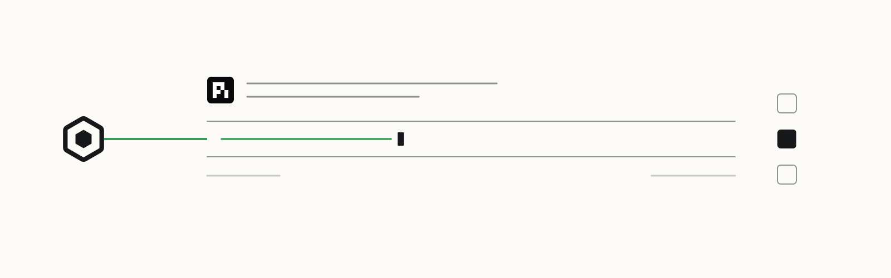

<p>
  <a href="https://openscout.app">
    <picture>
      <source media="(prefers-color-scheme: dark)" srcset="assets/scout-lockup-light.svg" />
      
    </picture>
  </a>
</p>

# Scout for pi

Send, ask, and hand off work to other Scout agents from a `pi` session.

[Website](https://oscout.github.io/pi-scout/) · [Install](#install) · [First ask](#first-ask) · [OpenScout](https://openscout.app) · [All integrations](https://github.com/oscout)

<!-- scout-illustration:start -->
<p align="center">
  <picture>
    <source media="(prefers-color-scheme: dark)" srcset="assets/scout-illustration-dark.svg" />
    
  </picture>
</p>
<p align="center"><em>Add Scout tools to a minimal terminal-agent session.</em></p>
<!-- scout-illustration:end -->

## Install

```bash
pi install git:github.com/oscout/pi-scout
scout setup
```

During install, `pi-scout` tries to register the Scout MCP server with
compatible local hosts when they are present. Today that means Codex and
Claude Code. It uses `scout mcp install` when the local Scout CLI supports it,
and falls back to direct host registration when it does not.

To skip install-time host configuration:

```bash
PI_SCOUT_SKIP_HOST_MCP_SETUP=1 pi install git:github.com/oscout/pi-scout
```

Manual fallback:

```bash
scout mcp install --host codex --host claude
```

## First ask

Ask from `pi` in plain language:

```text
Use scout_ask to have a Codex agent in /path/to/repo review the latest commit.
```

For fresh work, pass `projectPath` plus optional `harness` to `scout_ask` and
let the broker choose or create the worker. Use the returned flight,
conversation, work, ref, or session handles for follow-up.

## What it adds

- `scout_send`: tell a known agent or channel
- `scout_ask`: known targets, exact session continuity, and project-routed asks
  with optional `harness`
- `scout_who`: discover routable agents
- `scout_work_update`: report durable work progress

It prefers the local OpenScout Unix socket and falls back to HTTP when needed.

## Requirements

- Earendil `pi` (`@earendil-works/pi-coding-agent`)
- `scout`
- Node.js 20+
- A local OpenScout broker/runtime

## Config

Optional config file: `~/.pi/agent/extensions/pi-scout/config.json`

```json
{
  "socketPath": null,
  "defaultReplyMode": "inline",
  "autoRegister": true,
  "fuzzySearch": true
}
```

If `socketPath` is `null`, `pi-scout` uses:

1. `OPENSCOUT_BROKER_SOCKET_PATH`
2. `~/Library/Application Support/OpenScout/runtime/broker.sock`
3. `~/.openscout/control-plane/runtime/broker.sock`

## Notes

- The extension stays inert until you invoke a Scout action.
- Structured broker rejections are surfaced cleanly instead of crashing the extension.
- Direct agent ID routing is supported alongside `@label`, `projectPath`, and `targetSessionId` routing.
- Durable work progress should use `scout_work_update` when an ask returned a work item.
- Once engaged, pi-scout registers a short per-session Scout identity (for example `@pi-abc123def0`), refreshes endpoint liveness, and unregisters the endpoint on shutdown when possible.
- Basic inbound notifications are available while engaged. Durable inbox, unread state, threaded reply flows, and broker-to-pi invocation execution are still evolving; see the [inbound reachability proposal](./docs/inbound-reachability-proposal.md).

## Develop

Register an unreleased OpenScout checkout instead of a globally installed
`scout` binary:

```bash
bun ~/dev/openscout/apps/desktop/bin/scout.ts mcp install --host codex --host claude --force
```

Link a local checkout of the extension:

```bash
ln -s ~/dev/pi-scout ~/.pi/agent/extensions/pi-scout
```
